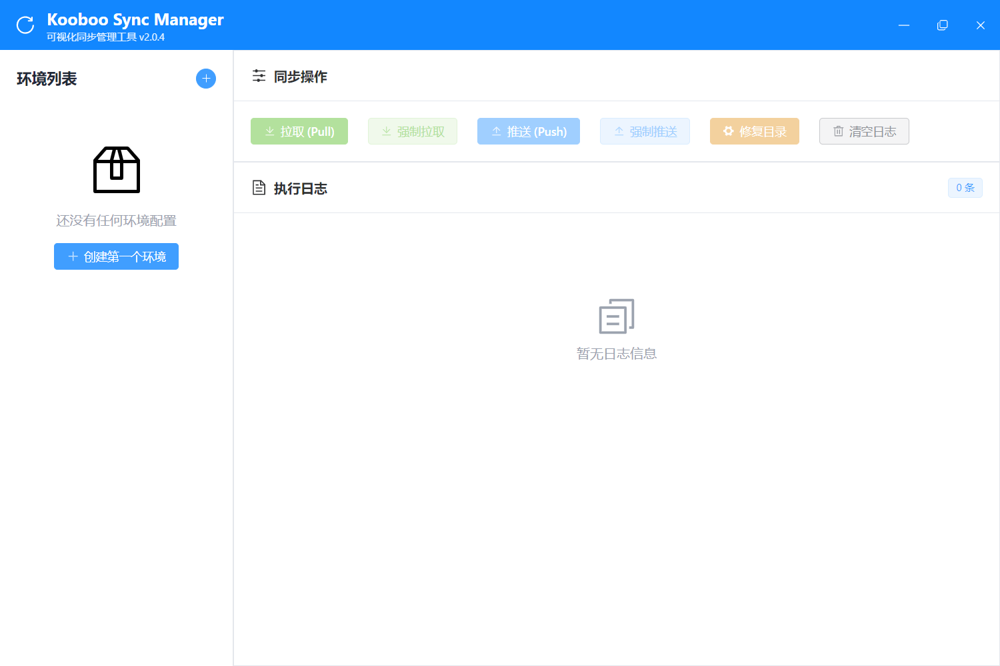

# Kooboo Sync Manager

Kooboo Sync Manager 是基于 Kooboo Sync 开发的 Electron 桌面同步工具。它用于把 Kooboo 站点代码与站点设置同步到本地目录，便于 Git 管理、协作开发和人工校验。

## 效果图



## 功能概览

- 代码模块同步：`Page`、`View`、`Layout`、`Api`、`Code`、`Style`、`Script`、`Label`
- 站点数据同步：当前支持 `Settings`
- 多环境支持：支持新增、编辑、复制、删除、拖动排序
- 修复目录：自动修复本地模块目录结构并补齐 `__metadata.json`
- 初始化开发配置：为目标目录生成 AI 编码规则、Kooboo 类型提示和 UnoCSS 代码提示配置
- 桌面端环境管理、实时日志和可视化操作

## 快速开始

### 1. 安装依赖

```bash
pnpm install
pnpm run build
```

## 桌面应用

### 开发模式运行

```bash
pnpm run electron:dev
```

### 打包 Windows 安装程序

```bash
pnpm run electron:build
```

也可以使用：

```bash
pnpm run electron:build:win
```

### 打包 macOS 应用

```bash
pnpm run electron:build:mac
```

常用变体：

```bash
pnpm run electron:build:mac:x64
pnpm run electron:build:mac:arm64
pnpm run electron:build:mac:universal
pnpm run electron:build:mac:unsigned
```

说明：

- `electron:build:mac:unsigned` 会关闭证书自动发现，用于先生成未签名安装包
- 真正对外分发时，仍建议使用 Apple Developer ID 签名并做 notarization
- macOS 打包应在 macOS 机器上执行，不要指望在 Windows 上直接产出可用的 macOS 发布包

仓库中还提供了 Windows 辅助脚本：

```powershell
./setup-desktop-app.ps1
```

### 桌面端提供的能力

- 环境列表管理，支持新增、编辑、删除环境
- 支持复制环境，复制后环境名称自动追加 `Copy`
- 支持拖动调整环境顺序
- 图形化配置用户名、密码、API 地址、站点 ID、同步模块、自动上传、目标目录
- 一键执行拉取、强制拉取、推送、强制推送、修复目录、初始化开发配置、站点配置拉取、站点配置推送
- 实时日志面板显示信息、警告、错误
- 右侧操作面板可直接切换自动上传开关
- 图形化选择目标文件夹

### 桌面端配置存储位置

- Windows：`%APPDATA%\kooboo-sync\environments\*.json`
- macOS：`~/Library/Application Support/kooboo-sync/environments/*.json`
- Linux：`~/.config/kooboo-sync/environments/*.json`

### 桌面端配置示例

```json
{
  "LABEL": "开发环境",
  "BASIC_AUTH_USER_NAME": "your-username",
  "BASIC_AUTH_PASSWORD": "your-password",
  "API_BASE_URL": "https://your-server.kooboo.io",
  "SITE_ID": "xxxxxxxx-xxxx-xxxx-xxxx-xxxxxxxxxxxx",
  "SYNC_MODULES": "Page,View,Layout,Api,Code,Style,Script,Label",
  "FOLDER_NAME": "Kooboo",
  "AUTO_UPLOAD": false
}
```

注意：

- 桌面应用不依赖项目中的 `.env` 文件
- 密码当前以明文形式保存在本机配置文件中，建议使用权限受限的专用同步账号
- 站点 `Settings` 会同步到本地 `Site/config.json`
- 开启 `AUTO_UPLOAD` 后，会监听当前选中环境的站点目录变化并自动上传对应模块

### 关键功能说明

#### 修复目录

`修复目录` 用于整理当前环境的目标文件夹，适合在手动新增、删除或重命名本地模块文件后执行。

它会根据当前环境的 `SYNC_MODULES`：

- 创建缺失的目标目录和模块目录
- 为缺失的模块生成或更新 `__metadata.json`
- 移除 `__metadata.json` 中已经没有对应本地文件的记录
- 将未登记到 `__metadata.json` 的本地模块文件补入 metadata，新记录使用空 GUID，推送时由 Kooboo 创建远端项目
- 对 `Api` 新文件自动补 `url: "/文件名"`，对 `Page` 新文件自动补 `path: "/文件名"`
- 对 `Label` 模块创建或规范化本地标签文件

#### 初始化开发配置

`初始化开发配置` 会在当前环境的目标文件夹中创建开发辅助文件。已存在的文件会跳过，不会覆盖。

默认会初始化：

- `AGENTS.md`：给 AI 编码助手看的项目规则，说明哪些 Kooboo 文件可以修改、同步时要注意什么
- `kooboo.project.d.ts`：Kooboo 项目类型入口
- `types.kooboo.d.ts`：Kooboo 运行时 API 类型提示
- `tsconfig.json`：让编辑器识别类型提示
- `uno.config.ts`：本地 UnoCSS 代码提示配置

#### 站点配置和 UnoCSS

- 拉取站点配置会把 Kooboo 站点 `Settings` 保存到 `Site/config.json`
- 推送站点配置会把本地 `Site/config.json` 更新到 Kooboo 站点
- `Site/config.json` 中的 `unocssSettings.config` 是 Kooboo 站点的权威 UnoCSS 配置
- 本地 `uno.config.ts` 是给编辑器代码提示使用的辅助文件，会在拉取或推送站点配置时根据 `Site/config.json` 自动刷新

## 项目结构

| 路径 | 说明 |
| --- | --- |
| `src/` | 同步核心逻辑与 API 封装 |
| `electron/` | Electron 主进程、预加载脚本和 Vue 界面 |
| `dist/` | TypeScript 编译产物 |
| `dist-electron/` | Electron 前端构建产物 |
| `release/` | 桌面应用打包输出 |

## 开发命令

```bash
pnpm run build
pnpm run electron:dev
pnpm run electron:clean
pnpm run electron:build
```

建议在执行同步前先提交或暂存本地改动，避免强制操作覆盖未保存的内容。

## 许可证

MIT
